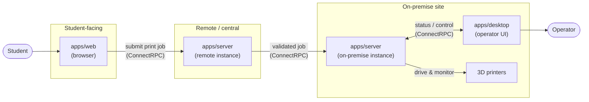
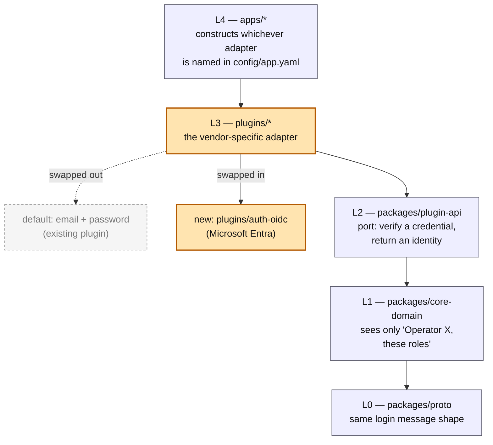

# Capstone

Fleet management software for 3D printers, built as a university capstone project.

A monorepo delivering three applications — a server, a web app, and a desktop app.

| Application | Path            | Stack                                          |
| ----------- | --------------- | ---------------------------------------------- |
| Server      | `apps/server/`  | Python, ASGI, ConnectRPC                       |
| Web app     | `apps/web/`     | React, TypeScript, Vite                        |
| Desktop app | `apps/desktop/` | Python backend (pywebview) with a React frontend |

The web and desktop apps are separate applications. They communicate only through the server,
and share code through `packages/ui-kit` and `packages/api-client` rather than by importing one
another.

## Status

Early. The repository currently holds governance, tooling and documented decisions; application
code is the next phase.

## Getting started

Run **`/onboarding`** in Claude Code or Copilot. It installs the toolchain, wires the git
hooks, prepares configuration, and opens the documentation.

Everything it does is also written out in `.claude/skills/onboarding/SKILL.md` if you would
rather follow it by hand.

## Documentation

| Where                  | What                                                                  |
| ---------------------- | --------------------------------------------------------------------- |
| `docs/index.html`      | The documentation site. Open it in a browser; there is no build step. |
| `AGENTS.md`            | Conventions, enforced by hooks and CI. Read before contributing.      |
| `.integrity/POLICY.md` | AI use policy. **Required reading before your first commit.**         |

## System architecture

Intended high-level architecture and data flow. `apps/server` runs twice: a remote instance that
faces students over the internet, and an on-premise instance at each print site that drives the
printers directly. The two talk to each other; nothing external talks to the on-premise instance
directly.

The remote server handles and validates incoming requests before they ever reach a site; the
on-premise server is the only thing that talks to printers, and it is what the desktop app
connects to for operators managing that site.

## Codebase Design

| Layer | Path | Why it's a separate layer |
|---|---|---|
| L0 | `packages/proto/` | The wire contract. Server, web and desktop all agree on message shapes from one source, so they can't silently drift apart. Everything may depend on it; it depends on nothing. |
| L1 | `packages/core-domain/` | Domain logic that is reusable across multiple applications. |
| L2 | `packages/plugin-api/` | Contract interface that the core domain needs. Abstract interface that defines the behavior expected from the implementation. |
| L3 | `plugins/*` | The vendor-specific half of the implementation. An adapter translates one external system into the interface expected by the core domain. Swapping the vendor means writing or reconfiguring an adapter, never touching the domain. |
| L4 | `apps/*` | The only place allowed to construct a concrete adapter and wire it to a port. A deployment's specific integrations become a matter of _which adapters get constructed_, not a code change. |

The diagram traces a concrete case through those layers: a new deployment switching its identity
provider from the default email-and-password login to Microsoft Entra. Highlighted means it
changes; the rest does not.

`import-linter` enforces the design generally. Only L3 changes for the switch: `apps/*` (L4)
already knows how to construct whichever adapter is named in `config/app.yaml`, so swapping
providers means changing that one line, never touching the port, the domain, or the wire
contract.

---

## AI Use Statement

This project uses AI coding assistants, and does so under a written policy:
[`.integrity/POLICY.md`](.integrity/POLICY.md).

- **Tool:** Claude Code, GitHub Copilot CLI, and locally-run open-source models.
- **Mode:** Local.
- **Output:** repository scaffolding, git hooks, CI workflows, agent skills, documentation, and
  drafts of the architecture decision records. Application code as the project proceeds.
- **Data:** none. No sponsor or personal data is placed in prompts; data is described by its
  shape, never its contents. Hosted tooling here is consumer-tier rather than an enterprise
  tenancy, so prompts sent to it are treated as leaving the organisation permanently. Prompts
  to the locally-run models do not leave the machine.
- **Verified:** _[each developer records their own verification per commit; see the AI Use
  Statement in individual commit messages]_

Each commit produced with agent assistance carries its own statement naming the tool, model,
mode, what was generated, and how the developer checked it. Session transcripts are exported to
a team audit log by `scripts/export_ai_audit.py`.

Developers remain the authors of what they commit and are accountable for understanding it.
Agent assistance does not transfer that.

## Reference

> _Policy on the Use of Generative AI._ ENEL 500 — Computer, Electrical, and Software
> Engineering Team Design, Fall 2026. Department of Software and Electrical Engineering,
> University of Calgary. Hamidreza Zareipour. Accessed via D2L.
